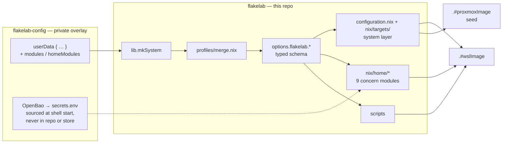

# flakelab

A complete developer environment, not a distro image: zsh/Oh My Zsh,
Kubernetes tooling, native Docker, cloud CLIs, language runtimes, AI CLIs and
dev utilities, applied with a single `flakelab update`. Two targets share this
one flake — `wsl`, a distro on top of
[NixOS-WSL](https://github.com/nix-community/NixOS-WSL) with the Windows-side
provisioning that stands a machine up from nothing, and `proxmox-vm`, a
Proxmox guest built from a seed image and bootstrapped in place.

Both targets need WSL >= 2.5.7 (native systemd) or an equivalent
`x86_64-linux` host — the flake builds for **`x86_64-linux` only**:
`nixosConfigurations.default`, `nixosConfigurations.proxmox-vm`, `.#wslImage`,
`.#proxmoxImage`, the dev shell and every `nix flake check` output are declared
for that system and no other, so an `aarch64` Windows box or an Apple Silicon
host cannot build or run this system.
Design and internals: [`ARCHITECTURE.md`](ARCHITECTURE.md).
Planned work: [`BACKLOG.md`](BACKLOG.md).

> ⚠️ **Provisioning wipes host interop, and the stable channel has no
> protection.** Building a NixOS distro removes `WSLInterop` for every distro in
> the WSL2 VM (`binfmt_misc` is kernel-global); recovery is `wsl --shutdown` from
> Windows. The upstream fix
> ([#40621](https://github.com/microsoft/WSL/pull/40621)) reached the
> **pre-release channel only, from 2.9.3 on** — no stable release through 2.7.12
> carries it. Run `flakelab build-distro` / `flakelab test-provision` only from
> an expendable session.
> **[`known-issues.md`](known-issues.md) is the full account** — read it before
> provisioning.

## Architecture at a glance

Two repos: a private overlay flake supplies the **data** (plus optional extra
modules); this repo holds the machinery and no personal values. Everything
flows through the typed `options.flakelab.*` schema — a typo aborts evaluation,
defaults are neutral — into per-concern modules, from which the same
configuration builds a WSL tarball or a Proxmox seed image, picked by
`target`. Secrets arrive at runtime from a vault, never entering repo or store.



Not drawn: `nix flake check` (the six offline suites plus statix/deadnix) and
`devShells.default` guard every change with the same pinned tooling.

## Bootstrap

**Must** — from a **Windows** PowerShell, once WSL itself is installed
(`wsl --install --no-distribution`, once per machine, may reboot):

```powershell
git clone https://github.com/tyclab/flakelab; cd flakelab; .\setup-wsl-nix.cmd provision -Shutdown
```

Four questions (Linux user, git name, git mail, which profiles), then it
generates the private overlay next door (`..\flakelab-config`), downloads the
base image, imports the `flakelab` distro, applies the overlay twice and prints
`wsl -d flakelab`. **No token, key or secret is needed** — the steps that want
one defer and say so. `-Shutdown` pre-answers the `wsl --shutdown` the run
offers after each rebuild (the rebuild wipes WSL interop VM-wide, a shutdown is
the only heal, and it kills every WSL session on the machine); leave it off to
be asked instead. The answers land in
`..\flakelab-config\files\config\user_data.yaml` — the same schema as
[`files/config/user_data.example.yaml`](files/config/user_data.example.yaml),
so everything optional (locale, aliases, env vars, MCP servers, plugins, extra
repos) is added there, then `provision -Force` regenerates the flake from it.

**Optional** — same command, add what applies:

| Flag                                       | When                                                                                                                                                                |
| ------------------------------------------ | ------------------------------------------------------------------------------------------------------------------------------------------------------------------- |
| `-Config <user_data.yaml>`                 | You already have a config (second machine, unattended runs): skips the questions. Required when there is no console to ask in.                                      |
| `-FlakeRef <dir>`                          | Put the overlay somewhere other than `..\flakelab-config` (a scratch dir for a test run, a synced folder).                                                          |
| `-DistroName <name>` / `-InstallDir <dir>` | Distro name and vhdx location (defaults `flakelab`, `%LOCALAPPDATA%\WSL\<name>`). `-InstallDir D:\wsl\flakelab` when C: is tight.                                   |
| `-Tarball <nixos.wsl>` / `-ImageUrl <url>` | Reuse a downloaded base image, or pin / mirror the release (air-gapped).                                                                                            |
| `-SshPassphrase <pw>`                      | Load the key under `<overlay>\files\config\shared\ssh\keys` into the distro's ssh-agent unattended, so the SSH-dependent activation steps run instead of deferring. |
| `-RestoreInstance <name>`                  | Restore a `flakelab backup` payload written under another distro's name (migrating a box called `NixOS` into `flakelab`).                                           |
| `-SkipCloneRepos` / `-SkipSecondSwitch`    | Faster iteration when debugging provisioning; both steps are idempotent and run later anyway.                                                                       |
| `-Force`                                   | Regenerate the overlay flake from the config (a hand-edited flake is otherwise kept).                                                                               |
| `-DryRun`                                  | Print every step, touch nothing.                                                                                                                                    |

`setup-wsl-nix.cmd` is the entry point: it supplies the execution-policy
boilerplate a bare `.\setup-wsl-nix.ps1` call trips over, passes arguments
straight through, and double-clicked with no arguments offers a
status / dry-run / provision menu with a warning gate before the real run.

**The config is small.** Four things are required — `user`, `gitfullname`,
`gitmail`, and at least one of `profiles:` (entries of [`profiles/`](profiles)),
`gitlab_groups:` or `repos:`; a config that resolves to none of the three is
refused, because it would build green and leave the box with no profile
packages and an empty `~/git`. A GitHub-only adopter names their clones under
`repos:` and needs neither of the other two — the questions cover that with
their last, optional prompt.

Without a console, `-Config` or an existing `..\flakelab-config` — `provision`,
`bootstrap` and `generate` **refuse**: this repo's own values are placeholders
(`youruser`, no keys, no MCP servers, no plugins), and a distro built from them
is not a usable box. Only `status` still reports that fallback. Declining the
interop heal right after the first switch stops the run — nothing has been
seeded yet, and re-running `provision` resumes from there with the import
skipped.

| Command     | Action                                                                                                                                                     |
| ----------- | ---------------------------------------------------------------------------------------------------------------------------------------------------------- |
| `status`    | **default** — overlay / config / key / secrets / distro / interop                                                                                          |
| `provision` | the fresh-PC run: generate the overlay, `bootstrap`, restore (`-RestoreInstance <name>` restores a backup instance saved under another distro name), clone |
| `generate`  | write the overlay flake from the config and STOP (inspect / `nix eval`)                                                                                    |
| `init`      | overlay skeleton with PLACEHOLDERS, for writing the flake by hand                                                                                          |
| `bootstrap` | base image, import, and the two `nixos-rebuild switch` runs                                                                                                |

The generated overlay flake is the profile from then on: `provision` never
overwrites an existing one, so hand-edits survive. `-Force` regenerates it from
the config; `generate` writes it and stops, for a look (or a `nix eval`) before
anything is imported.

A `provision` applies the overlay **twice** — the SSH-dependent steps need a
user that only the first switch creates. The second switch runs **only if a
private key was in the overlay and went into the ssh-agent**; on the keyless run
this README recommends there is nothing to load, so it is skipped and the
SSH-dependent steps stay deferred until a later `flakelab update`. See
[`ARCHITECTURE.md`](ARCHITECTURE.md#why-two-switches).

**Both this checkout and the overlay must sit on a Windows drive** —
`C:\Users\<WindowsUser>\git\`, not WSL's own filesystem reached through `\\wsl$`.
Every path handed to the distro is converted by stripping the drive letter, so a
UNC path has nothing to convert and the run fails. A space in the path is
percent-encoded into the flake URLs and quoted into the key and secrets seeding
commands (`C:\Users\First Last\git\`); a single quote or a `#` in a folder
name is refused outright — nothing can quote the first across the `wsl.exe`
boundary, and the second is the flake-ref fragment delimiter, so `--flake
<path>#default` would be cut at it.

What is still manual: installing WSL; filling in the config; placing a private
SSH key in the overlay's `files\config\shared\ssh\keys\` and populating
`secrets.env` (see [Secrets](#secrets)) if you want the steps that need them —
before a distro exists, that file is the Windows-side
`<overlay>\files\config\shared\secrets\secrets.env`, which is the one
`provision` reads and writes; and any `flakelab.*` option the config schema has
no counterpart for — the AI-CLI and plugin options among them — which keep the
default their option declares in [`nix/options.nix`](nix/options.nix) until the
generated flake is edited.

After the first login:

```powershell
wsl -d flakelab
flakelab doctor                  # verify what activation cannot check unattended
flakelab clone                   # needs GITLAB_TOKEN (see Secrets)
```

### Already inside a distro

`flakelab provision` drives the read-only half of the same script over interop:

```bash
flakelab provision status                 # read-only, runs in the foreground
flakelab provision provision -- -DryRun   # rehearsal, also foreground
flakelab provision provision              # prints the PowerShell command to paste
```

The doubled word is not a typo — the second word is the `setup-wsl-nix.ps1`
command passed through. It refuses to run `provision` or `bootstrap` from inside
the distro they restart, and prints the command to paste instead.

### No Windows? Generate the overlay on Linux or macOS

The overlay is the one artefact an adopter needs before anything else, and
`files/scripts/nix-overlay-generate` writes it with no PowerShell, no WSL and no
distro. It is a **zsh** script — zsh is the only prerequisite for generating,
and `nix` is needed for the `nix flake metadata` check below and for anything
that applies the result:

```bash
git clone https://github.com/tyclab/flakelab && cd flakelab
cp files/config/user_data.example.yaml ~/my-user_data.yaml   # then fill it in
./files/scripts/nix-overlay-generate --out ~/git/flakelab-config \
  --config ~/my-user_data.yaml
nix flake metadata ~/git/flakelab-config                     # it locks as written
```

Same schema as `provision -Config`, same refusals, same split of secrets (the
tokens are dropped, not written; only an empty mode-600 git-ignored
`secrets.env` stub is created). Run **from a checkout** and `--flakelab-ref`
defaults to `path:` that checkout, which is why the lock above works offline —
as `flakelab overlay-gen` from PATH it is required instead
([`ARCHITECTURE.md`](ARCHITECTURE.md#options-and-the-overlay) says why).

It does not provision: applying a `wsl`-target overlay is
`setup-wsl-nix.ps1 provision` from Windows, or
`sudo nixos-rebuild switch --flake <overlay>#default` inside a distro that
already runs NixOS-WSL; a `proxmox-vm`-target overlay applies via
`flakelab-bootstrap` on a `.#proxmoxImage` seed instead (below). macOS is a
place to **generate** from, not to run this system: the flake's outputs are
`x86_64-linux` only (above), so the overlay written on a Mac is applied on an
`x86_64-linux` NixOS box — WSL2 or a Proxmox guest.

## Daily commands

Everything is a subcommand of the one `flakelab` binary; `flakelab --help` lists
all fifteen.

| Command                   | Action                                                                    |
| ------------------------- | ------------------------------------------------------------------------- |
| `flakelab update`         | `sudo nixos-rebuild switch --flake path:<repoPath>#<flakeAttr>`           |
| `flakelab update-all`     | rebuild + clone                                                           |
| `flakelab clone`          | clone / fetch GitLab group repos                                          |
| `flakelab doctor`         | diagnose a provisioned distro                                             |
| `flakelab backup`         | payload + optional shared state root                                      |
| `flakelab sessions`       | running Claude Code sessions; `--save` before a restart, `--resume` after |
| `flakelab overlay-gen`    | write the private overlay from a config                                   |
| `flakelab test-provision` | throwaway-distro smoke test (interop-wiping)                              |

`update` / `update-all` are commands, not aliases: they gate the rebuild on a
drift check's exit status. Without a terminal they refuse to rebuild from a
stale or unverifiable flake tree (`FLAKELAB_STALE_OK=1` waives it per
invocation); a checkout behind the default branch warns and, at a terminal,
offers a rebase.

They also re-lock a **`path:`** flakelab input before the switch, saying so in
one line. An overlay generated from a checkout points at it with `path:`, which
is mutable while its `flake.lock` entry is not — so without the re-lock every
`git pull` in the flakelab checkout leaves the rebuild evaluating the previously
locked snapshot, successfully and silently. A `github:` or `git+` input is left
alone: that pin is deliberate.

Activation ends in a health check, and `flakelab doctor` covers what it cannot
assert from a non-interactive context; which failures are fatal and which are
only deferred is in
[`ARCHITECTURE.md`](ARCHITECTURE.md#activation-and-the-health-check). Override a
failing check with `touch ~/.local/state/flakelab/skip-healthcheck`.

`gitchecker`, `gitcleaner` and `gitpublisher` are **not** subcommands — they stay
standalone. AI CLIs: `k`/`kk`/`kwsl` (Kiro) and `c`/`cc`/`cwsl` (Claude Code) —
base / full-trust / in-repo.

**Repo discovery is GitLab-only.** `flakelab clone` enumerates groups through
`glab`, so `gitlabGroups` and the profiles are a GitLab concept; repos on other
forges are cloned by naming them individually under `repos` in the config.

## Where configuration lives

`nix/users/default.nix` in this repo holds **placeholders**, and the supported
way to set your values is the private overlay flake — a small flake that calls
`flakelab.lib.mkSystem` with your data. Flakes only evaluate git-tracked files,
so a git-ignored config would be invisible to `nixos-rebuild`; the overlay keeps
real values out of a public fork instead. Scaffold it, do not write it by hand:

```powershell
.\setup-wsl-nix.ps1 init -FlakeRef ..\flakelab-config    # skeleton, placeholders
```

```bash
nix flake new -t github:tyclab/flakelab#overlay flakelab-config
./files/scripts/nix-overlay-generate --out ../flakelab-config \
  --config ~/my-user_data.yaml                           # filled in from a config
```

All three produce the same two files, but only `.gitignore` is copied from
`templates/overlay/` verbatim. `flake.nix` is **generated** whenever a config is
given; `init` and a bare `nix flake new` emit the template's placeholder text
instead, for hand-editing. `init` and `nix-overlay-generate` also create
`files/config/shared/ssh/keys/` and point the `flakelab` input at this
checkout; `nix flake new` leaves that input on the
public coordinate, which you edit (one marked line) or override with
`--override-input flakelab path:/path/to/flakelab`. Then point `repoPath` at the
overlay and rebuild with `flakelab update`.

[`nix/options.nix`](nix/options.nix) is the schema of record — every option, its
type, default and description. Read one with:

```bash
nix eval .#nixosConfigurations.default.options.flakelab.stateRoot.description
```

One of them is per box rather than per person: `hostName` sets the distro's
`networking.hostName` and defaults to `flakelab`, so a box registered under
another name — or a second box built from the same overlay — overrides it there.
An existing box therefore flips from `nixos` to `flakelab` at its next
`flakelab update`, effective at the next distro restart; set
`hostName = "nixos"` in the overlay to keep the name it has.

This repo ships **no committed secrets**; the personal values live in the
private overlay. `profiles/example.nix` and
`files/config/user_data.example.yaml` are neutral placeholders — replace them
with your own rather than reading them as defaults.

### Layout

| Path                                  | Purpose                                                                                           |
| ------------------------------------- | ------------------------------------------------------------------------------------------------- |
| `flake.nix`                           | inputs, `nixosConfigurations.{default,proxmox-vm}`, `lib.mkSystem`, `.#wslImage`/`.#proxmoxImage` |
| `nix/options.nix`                     | `flakelab.*` option schema — the names, types and defaults of record                              |
| `nix/configuration.nix`               | system, every target: locale, native Docker, nix-ld                                               |
| `nix/targets/`                        | the platform half: `wsl.nix` (wsl.conf, interop), `proxmox-vm.nix`                                |
| `nix/home/`                           | user: packages, zsh, git/ssh, mcp, kiro, claude, tooling, health, backup                          |
| `nix/users/default.nix`               | per-user values (placeholders here; real ones in the overlay)                                     |
| `nix/scripts.nix`                     | the per-command wrappers (pinned PATH + exported env) each subcommand runs                        |
| `nix/cli.nix`                         | assembles those wrappers into the `flakelab` CLI                                                  |
| `files/scripts/flakelab`              | the router: subcommand table, `--help`, did-you-mean                                              |
| `profiles/`                           | profile registry + merge (`example`)                                                              |
| `templates/overlay/`                  | scaffold for the private overlay flake (`init`, `flake new`, `overlay-gen`)                       |
| `files/`                              | scripts + config consumed by the flake                                                            |
| `files/config/user_data.example.yaml` | provisioning config for `provision -Config` / `overlay-gen`                                       |
| `files/config/claude/target-*.md`     | per-target facts appended into the managed `~/.claude/CLAUDE.md`                                  |
| `setup-wsl-nix.ps1`                   | Windows provisioning: status / generate / init / bootstrap / provision                            |
| `.github/workflows/release.yml`       | tag push → builds and publishes the `.#proxmoxImage` seed asset                                   |

## Secrets

Nothing secret lives in the repo or the Nix store in plaintext. Two sources,
tried in this order at shell start:

1. **sops-nix (opt-in)** — the overlay sets
   `sopsSecretsFile = ./secrets/secrets.env;`, an age-encrypted sops **dotenv**
   file it commits as ciphertext. sops-nix decrypts it at activation into the
   `/run/secrets` ramfs (`/run/secrets/tyc-env`, mode 0400, owned by the login)
   and the zsh init sources it from there — plaintext never touches a disk, a
   repo, or a backup. Enrolment per host: `age-keygen -o <keyFile>` (default
   `/var/lib/sops-nix/key.txt`; point `sopsAgeKeyFile` at a disk excluded from
   image backups where one exists), add the printed recipient to the overlay's
   `.sops.yaml`, `sops updatekeys <file>`, set the option, `flakelab update`.
   Rotation: `sops <file>` edits values; `.sops.yaml` + `sops updatekeys`
   changes recipients.
2. **Legacy fallback** — `~/.config/tyc/secrets.env` (git-ignored), populated
   from a vault (`bao kv get …`) or by hand;
   `files/config/secrets.env.example` is a copyable skeleton.

`provision` writes the fallback file
for you from the `custom_env_vars` of the config it provisions from (it asks
first): the names in the table below go there, everything else becomes
`sessionVariables` in the generated flake, so no token reaches the
world-readable store. (`tyc` there is a fixed namespace this repo hardcodes,
not a setting.)

There are **two** files, and only one of them exists before a distro does. The
Windows side — `provision`, and anything you edit by hand on a fresh PC — reads
and writes `<overlay>\files\config\shared\secrets\secrets.env`. The in-distro
`~/.config/tyc/secrets.env` that the shell actually sources is restored from it
by `flakelab backup --restore`, which `provision` runs for you.

| Key                             | Needed by                                        |
| ------------------------------- | ------------------------------------------------ |
| `GITLAB_TOKEN`                  | `flakelab clone` (glab group discovery)          |
| `GH_TOKEN`                      | `gh` CLI, `gitchecker` open-PR listing           |
| `HASS_TOKEN`                    | homeassistant MCP (mapped to `HA_TOKEN`)         |
| `PROXMOX_TOKEN_ID`              | proxmox MCP                                      |
| `PROXMOX_TOKEN_SECRET`          | proxmox MCP                                      |
| `SYNOLOGY_PASSWORD`             | synology MCP                                     |
| `SYNOLOGY_DEVICE_ID`            | synology MCP (skips DSM 2FA re-prompts)          |
| `GRAFANA_SERVICE_ACCOUNT_TOKEN` | grafana MCP (covers Grafana + Prometheus + Loki) |

The non-secret half of each pair (`HASS_URL`, `PROXMOX_API_URL`, …) lives in
`sessionVariables`; the MCP servers inherit both halves from the shell, so a
missing key means that server starts and then fails on first call.

The Bitwarden CLI (`bw`) keeps whatever endpoint it already has unless
`bitwardenServer` names one (default `null`); set it — `"https://vault.bitwarden.eu"`
for the EU region — and every rebuild points `bw config server` there. Unlocking
stays interactive: `bwu` runs `bw unlock` on your TTY and parks the session token
it prints in mode-600 `~/.config/tyc/bw-session`, which every shell exports as
`BW_SESSION` — agents and MCP servers inherit it without the token ever appearing
on a command line or in a transcript; `bwl` locks the vault and removes the file.
The token is per-unlock (valid until `bw lock`/`bw logout`), so it is not a
`secrets.env` entry and `flakelab backup` does not carry it.

## Shared state between machines

`flakelab backup` writes a provisioning seed (host-specific: secrets, keys, tool
config) into the payload beside the overlay, and — if `stateRoot` is set —
machine-independent **state** (merged shell history, Claude Code auto-memory,
optionally session transcripts) into a plain directory your own sync client
replicates:

```nix
# in your overlay (flakelab-config/flake.nix)
stateRoot = "/mnt/c/Users/<you>/Sync/flakelab-state";   # a folder your sync client replicates
stateTranscripts = true;                    # optional
```

Unset (the default), nothing changes. Everything written into the state root is
scanned with `gitleaks` first and held back on a finding —
`flakelab backup --review-secrets` triages them. The merge semantics, the
conflict-copy handling, the fingerprint caveat and the two built-in refusals are
in [`ARCHITECTURE.md`](ARCHITECTURE.md#shared-state-and-the-secret-gate).
**Read that section before turning it on:** the merged history is everything
ever typed at a prompt.

## Proxmox VM

`nix build .#proxmoxImage` produces a generic qcow2 **seed**: cloud-init, the
qemu guest agent, keys-only sshd and the shared system layer, with no
home-manager closure and no personal values in it, so one image serves every
box. Each tagged release publishes it as `flakelab-proxmox-vm-<tag>.qcow2` next
to a `.sha256`, which is what a hypervisor pins and imports.

The seed is half a system. Write `/etc/flakelab/bootstrap.env` on the guest and
the `flakelab-bootstrap` unit clones your private overlay and switches the box
into it:

```ini
OVERLAY_URL=git@gitlab.example.com:you/flakelab-config.git
OVERLAY_REF=main
OVERLAY_ATTR=tycdev
BOOTSTRAP_USER=you
REPO_PATH=~/git/flakelab-config
OVERLAY_SSH_IDENTITY=~/.ssh/flakelab_deploy
OVERLAY_KNOWN_HOSTS=~/.ssh/known_hosts.flakelab
```

systemd parses that file itself rather than handing it to a shell: a `#` starts
a comment only at the start of a line, a trailing one is part of the value, and
nothing but a leading `~/` in the three path keys is expanded. `OVERLAY_URL` is
the only required key.

| Key                    | Default                                                        |
| ---------------------- | -------------------------------------------------------------- |
| `OVERLAY_REF`          | `main` — any branch or tag                                     |
| `OVERLAY_ATTR`         | `default` — the `nixosConfigurations` attribute to switch into |
| `BOOTSTRAP_USER`       | `flakelab.username`                                            |
| `REPO_PATH`            | `~/git/flakelab-config`                                        |
| `OVERLAY_SSH_IDENTITY` | `~/.ssh/<first sshKeys entry>`                                 |
| `OVERLAY_KNOWN_HOSTS`  | unset — `ssh -o StrictHostKeyChecking=accept-new`              |

`~/` resolves against the home the passwd database gives `BOOTSTRAP_USER`, which
is not always `/home/<user>`.

The clone, the lock and the checkout run as `BOOTSTRAP_USER`; only
`nixos-rebuild switch` runs as root. With no `OVERLAY_SSH_IDENTITY` that
`BOOTSTRAP_USER` can read, the unit exits 75 and names the path it wants — seed
the key, then `systemctl start flakelab-bootstrap`. A switch that activates the
new generation but warns on the way — a unit that would not start, or the
per-user activation for a user who is logged in while it runs — counts as done.
It runs once,
`/var/lib/flakelab/bootstrapped` is the marker, and
`journalctl -u flakelab-bootstrap` is the log. After that the box rebuilds with
`flakelab update` like any other.

The overlay declares the box on the `proxmox-vm` target, and `flakeAttr` is the
attribute `OVERLAY_ATTR` and `flakelab update` both switch into:

```nix
nixosConfigurations.tycdev = flakelab.lib.mkSystem {
  target = "proxmox-vm";
  userData = base // {
    hostName = "tycdev";
    flakeAttr = "tycdev";
    repoPath = "/home/tycorc/git/flakelab-config";
    sshKeys = [ "id_ed25519" "flakelab_deploy" ];
    extraReposDirs = [ ];
    stateRoot = null;
    backupRoot = "/mnt/backup/flakelab";   # a mount that outlives the guest
  };
  modules = [ { time.timeZone = "Europe/Berlin"; } ];
};
```

## Test and lint

```bash
make test          # the six offline suites, seconds
nix flake check    # the same suites + statix/deadnix; what CI runs
```

The dev shell, the hooks and the rest of the gate are in
[`CONTRIBUTING.md`](CONTRIBUTING.md#required-local-gate).

## Credits

Built on [NixOS-WSL](https://github.com/nix-community/NixOS-WSL) (the distro
image and WSL integration options),
[Home Manager](https://github.com/nix-community/home-manager) (the whole
user-environment layer), and [nixpkgs](https://github.com/NixOS/nixpkgs). The
interop findings in [`known-issues.md`](known-issues.md) build on the reports
and discussion in [microsoft/WSL](https://github.com/microsoft/WSL).

## About

Maintained under [tyclab](https://github.com/tyclab). The reasoning behind these
setups — WSL/NixOS, the homelab, and the automation around them — gets written
up at **[tycstation.com](https://tycstation.com)**.

Published as a traceable reference, not a supported product: issues and pull
requests are welcome, but nothing here carries a response-time promise.
